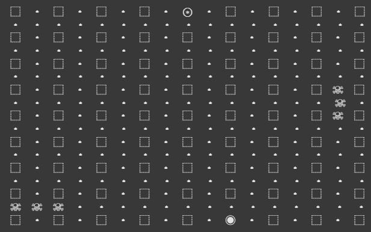

# 步步为营(Quoridor) - Minimax AI Game

## Project Objective
This project implements a two-player grid-based game where one player is controlled by an AI using 
the Minimax algorithm with alpha-beta pruning. The goal is to create an intelligent opponent that 
can evaluate future game states to make optimal moves.

## Game Progress
1-7-2025: Implemented a game state tree to facilitate the search algorithm

NOTE: ◉ is Player 0, ⊛ is Player 1 (AI), and ☠☠☠ are walls

TODO: Implement a heuristic function for all game stages
## Game Consultant:
https://www.instagram.com/huiddd0819