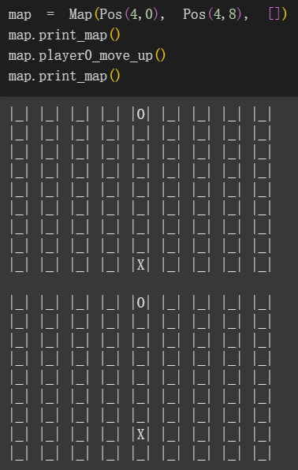

# 步步爲營(Quoridor) - Minimax AI Game

## Project Objective
This project implements a two-player grid-based game where one player is controlled by an AI using 
the Minimax algorithm with alpha-beta pruning. The goal is to create an intelligent opponent that 
can evaluate future game states to make optimal moves.

## Game Progress

## Coordinate System

